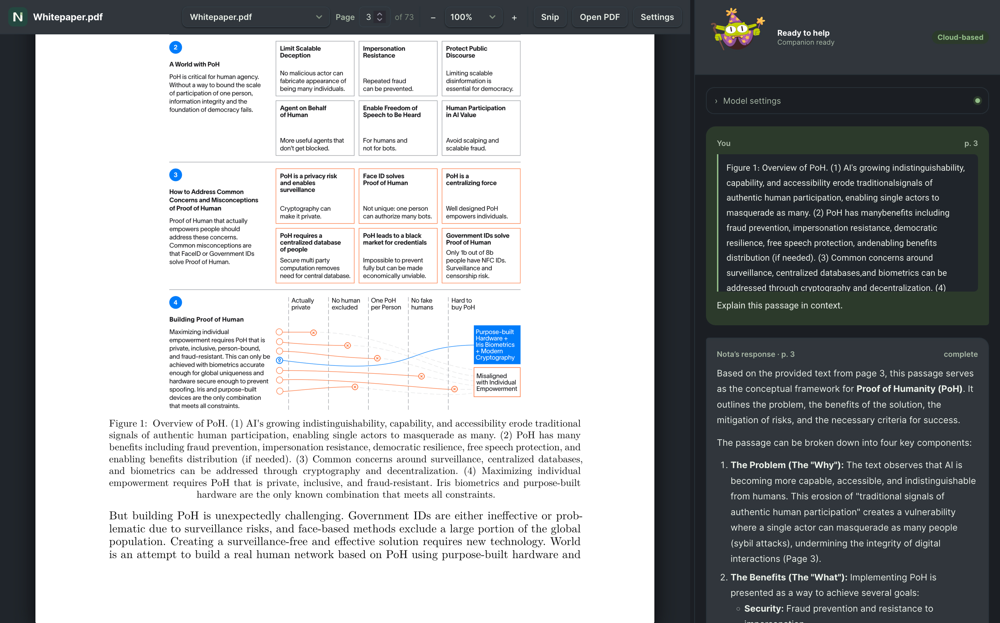

# Nota


**Read deeply. Keep your papers close. Ask for help when you need it.**

[](https://react.dev/)
[](https://www.typescriptlang.org/)
[](https://vite.dev/)
[](LICENSE)

Nota is a **local-first, privacy-focused academic PDF reader** with an on-demand AI mentor. It brings your paper,
highlights, notes, and explanations into a distraction-free workspace, so you can stay with the argument instead of
switching between tools.

Your reading library lives in your browser. AI runs through your configured Ollama daemon and only responds to explicit
actions. Choose a local model to keep inference on your machine, or opt into a cloud model when you want it.

**Status:** `0.1.0-rc.1` · Desktop browsers · English and Persian reading workflows



## Key features

- 📄 **PDF reader & virtualized viewport.** PDF.js through React-PDF powers continuous multi-page scrolling, page
  navigation, and 50–200% zoom. Only pages near the viewport mount their rendering layers. Your library remembers
  reading position and zoom, and identical files are deduplicated by SHA-256.
- 🖍️ **Normalized highlighting & local notes.** Page-relative geometric coordinates keep highlights aligned through zoom
  and PDF rotation. Highlights and notes persist in IndexedDB through Dexie.js, alongside your PDF library.
- ✂️ **Snip mode.** Select an equation, table, or complex diagram and explicitly request a multimodal explanation. Crops
  stay in memory; Nota checks the model's vision capability before submission.
- 🤖 **AI mentor & Rive mascot.** Translate, clarify, or ask about a passage through Ollama, using `gemma4:31b-cloud` or
  a manually selected local alternative. Responses stream as Markdown with KaTeX math. Assistant states drive the
  mascot's idle, pondering, explaining, and error poses; an SVG fallback supports load failures and reduced motion.
- 🔒 **Privacy by design.** Zero application telemetry, local document storage, and zero background inference triggers.
  Importing, scrolling, selecting, highlighting, and drawing a snip never invoke a model. **Fully local inference
  requires a local model and a loopback Ollama endpoint.**

## Privacy and data ownership

Nota has no application backend or account requirement. PDFs, reading positions, highlights, notes, and completed
translation/clarification cache entries are stored in your browser's IndexedDB. Conversations and snip previews are
session-only. Fonts, PDF worker, KaTeX assets, and Rive WASM are bundled locally; the README badges above are
GitHub-only remote images.

An explicit AI action sends bounded request context to the configured Ollama endpoint: selected text and available
nearby text, document/page context, your question and limited conversation history as applicable, or the selected snip
image. It does not upload the entire PDF. **The default `gemma4:31b-cloud` model uses Ollama Cloud**, and an explicit AI
action sends content immediately without a separate cloud confirmation dialog. Select a local model before your first AI
action if you want all inference to stay local. A remote Ollama endpoint also sends content off your machine. The route
badge reflects the configured model name and endpoint, rather than verifying a custom server's behavior. See
[Ollama's cloud documentation](https://docs.ollama.com/cloud) for service data handling.

Local storage is scoped to the browser and origin: `localhost`, `127.0.0.1`, and different ports have separate
libraries. Browser storage is not an encrypted vault or a backup; clearing browser site data or storage eviction can
remove it. Keep your original PDFs. **Data & privacy** lets you delete a paper and its associated data or reset the
library. Close other Nota tabs before deletion.

## Tech stack

| Layer              | Implementation                                                                                           |
| ------------------ | -------------------------------------------------------------------------------------------------------- |
| Frontend           | React 19, TypeScript, Vite 7, CSS Modules and shared UI primitives                                       |
| PDF engine         | React-PDF / PDF.js, locally bundled worker, TanStack Virtual                                             |
| Storage            | Dexie.js / IndexedDB; SHA-256 document identity in a Web Worker                                          |
| AI integration     | Browser `fetch` to Ollama, streamed NDJSON, bounded versioned prompts, cancellation and response caching |
| Response rendering | React Markdown, remark-gfm, remark-math, rehype-katex and KaTeX                                          |
| Mascot             | Rive React canvas runtime with local WASM, state projection and SVG fallback                             |
| Verification       | Node.js test runner, Vitest, Testing Library and fake-indexeddb                                          |

## Getting started

### Prerequisites

- **Node.js 22.13 or newer** and npm. The tests use Node's experimental TypeScript stripping.
- A modern desktop browser with IndexedDB and Web Worker support.
- [Ollama](https://ollama.com/download) running locally for AI assistance. PDF reading and annotations work without it.
  Local model memory requirements depend on the model and quantization you choose.

### Install and run

Replace `YOUR-OWNER` with the GitHub account or organization hosting this repository:

```sh
git clone https://github.com/YOUR-OWNER/Nota.git
cd Nota
npm install
npm run dev
```

Open **http://127.0.0.1:5173/**. The development server uses a fixed port so it does not silently switch to a different
browser library. For reproducible dependency installation, use `npm ci`.

### Configure Ollama

1. Start the Ollama app, or run `ollama serve` in a separate terminal if a daemon is not already running.
2. For fully local inference, download a model that fits your hardware. For example:

    ```sh
    ollama pull gemma4:e2b
    ollama list
    ```

3. In Nota, keep the endpoint at `http://localhost:11434`, enter the exact installed model tag (for example
   `gemma4:e2b`), and press **Check**. Changing the model does not start inference.
4. Open a PDF, select a passage, and choose **Translate / Clarify** or **Ask Nota**. For an image, use **Snip mode →
   Explain snip** with a vision-capable model.

The [Gemma 4 model catalog](https://ollama.com/library/gemma4) lists local and cloud variants. Text-only models can
handle passage requests; snips require a model reporting vision capability through Ollama's `/api/show`. Nota has **no
automatic model fallback**: select your local alternative explicitly. Translation quality, speed, and memory use vary by
model and hardware.

To use the default cloud model instead, sign in through Ollama and make `gemma4:31b-cloud` available to your daemon,
following the [Ollama cloud setup](https://docs.ollama.com/cloud) and
[model instructions](https://ollama.com/library/gemma4). Confirm it appears in `ollama list`, then press **Check** in
Nota. Cloud inference requires internet access. Nota does not collect an API key; keep Ollama authentication outside the
frontend and repository.

If the browser cannot connect, check that Ollama is listening on port `11434` and that the model appears in
`ollama list`. If origin access needs configuration, stop an existing daemon first, then start it with the exact Nota
origin allowed:

```sh
OLLAMA_ORIGINS=http://127.0.0.1:5173 ollama serve
```

For the macOS Ollama app, set `launchctl setenv OLLAMA_ORIGINS "http://127.0.0.1:5173"` and restart Ollama. Service and
Windows configuration differ; see the [Ollama FAQ](https://docs.ollama.com/faq). Keep the daemon bound to loopback. To
disable Ollama cloud features, configure `OLLAMA_NO_CLOUD=1` and restart the daemon, as described in that FAQ.

### Try the reader

Open your own PDF or choose the bundled English or Persian sample. Select text to highlight it, then expand **Highlights
& notes** to edit color or add a note. Reload to check persistence, or use **Saved papers** to switch documents. For an
AI request, **Stop response** cancels streaming; **Regenerate** bypasses the translation/clarification cache.

The small original samples exercise layout and text layers, rather than scientific extraction quality. The Persian
fixture contains shaped presentation glyphs that impair text extraction; Nota blocks sending damaged text. Use a PDF
with a correct ToUnicode map for translation checks. Scanned PDFs require OCR outside Nota. AI explanations should be
checked against the paper.

## Project structure

```text
Nota/
├── public/
│   ├── brand/               # Vector logo and home-screen icon
│   ├── samples/             # Core English and Persian PDF fixtures
│   └── mascot/              # Rive animation and adapter contract
├── src/
│   ├── components/ui/       # Shared controls, styles and design tokens
│   ├── domain/              # Document and highlight types
│   ├── features/
│   │   ├── reader/          # PDF viewport, navigation, selection and snips
│   │   ├── library/         # Import, deduplication and reading restoration
│   │   ├── highlights/      # Highlight rendering
│   │   ├── assistant/       # Request lifecycle, streaming and rich responses
│   │   ├── mascot/          # Rive adapter, state projection and fallback
│   │   └── settings/        # Data controls and model route labels
│   ├── infrastructure/
│   │   ├── db/              # Dexie schema and repositories
│   │   └── pdf/             # Hash worker, validation, geometry and cropping
│   ├── prompts/             # Versioned action prompts and context limits
│   ├── ollama.ts            # Model probing and streaming transport
│   └── App.tsx              # Workspace and assistant coordination
├── tests/                   # Unit, UI and browser regression harnesses
├── scripts/                 # Production asset verification
└── docs/                    # Design notes and manual verification guides
```

## Development and verification

```sh
npm run typecheck
npm test
npm run build
npm run verify:assets
npm run preview -- --port 4173
```

`npm test` runs the unit and UI suites without a live model. They cover storage transactions, document identity,
viewport geometry, request cancellation, caching, snips, explicit submission, and mascot behavior. The asset audit
verifies bundled references and application chunk limits. `npm run build` generates `dist/`; it is excluded from source
control.

Production preview is available at `http://127.0.0.1:4173/` and has its own browser library. If using AI there, allow
that origin in Ollama too. Nota has no service worker: serving the built app is still required, even when reading and
inference are entirely local.

For implementation details and manual checks:

- [Reader foundation](docs/READER_FOUNDATION.md)
- [Local highlights and notes](docs/LOCAL_HIGHLIGHTS.md)
- [Tutor pipeline](docs/TUTOR_PIPELINE.md)
- [Snip mode](docs/SNIP_MODE.md)
- [Release verification](docs/RELEASE_CANDIDATE.md)
- [Rive asset contract](public/mascot/README.md)
- [Original architecture proposal](docs/ARCHITECTURE.md) — historical design intent; some proposed choices differ from
  the implementation.

## Contributing

Bug reports, accessibility improvements, PDF rendering fixes, and thoughtful contributions to local AI workflows are
welcome. Read [CONTRIBUTING.md](CONTRIBUTING.md) for setup, checks, privacy boundaries, and what to include in an issue
or pull request. Use synthetic or shareable PDFs when reporting problems; avoid publishing private research or model
credentials.

## License

Nota's source code is available under the **[MIT License](LICENSE)**. Dependencies, model weights, and third-party
assets retain their respective licenses. The mascot is
[Character poses by avocadenko](https://rive.app/marketplace/28745-54500-character-poses/), licensed under
[CC BY 4.0](https://creativecommons.org/licenses/by/4.0/). See [THIRD_PARTY_NOTICES.md](THIRD_PARTY_NOTICES.md).

